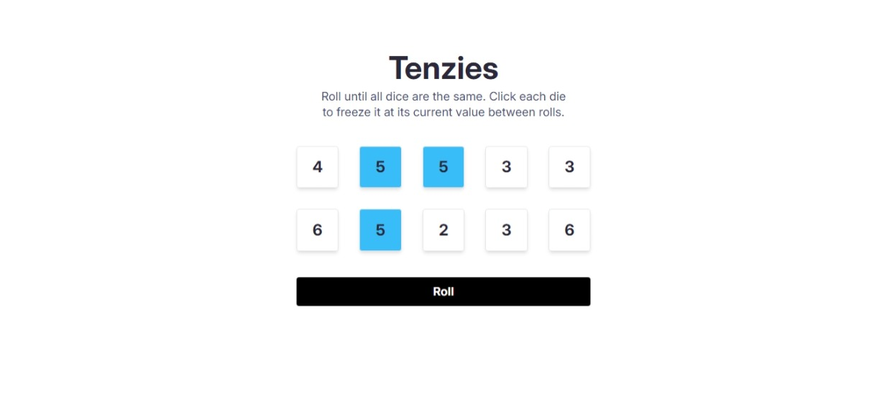
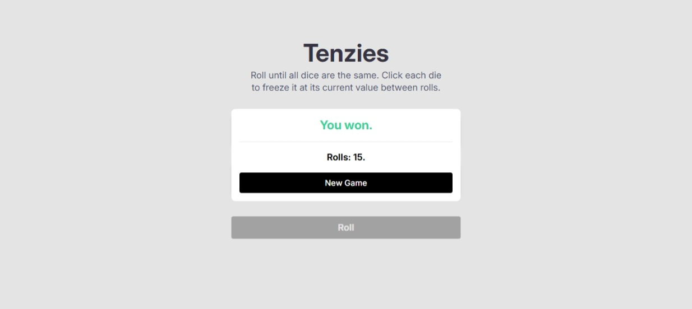
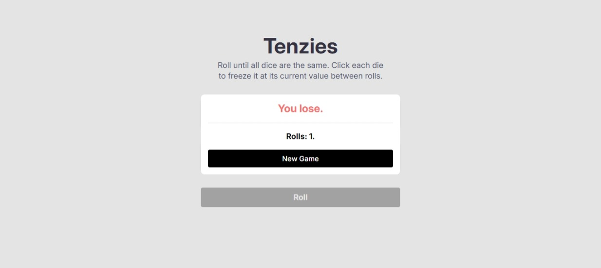

# Tenzies Game:

Roll until all dice are the same. Click each die to freeze it at its current value between rolls.
A game that inspired from Scrimba's React.js course.

## [Try the game from here.](https://iabdwahab.github.io/tenzies-game/)

## Built with:

- React.js.
- TailwindCSS.

## Screenshot:

